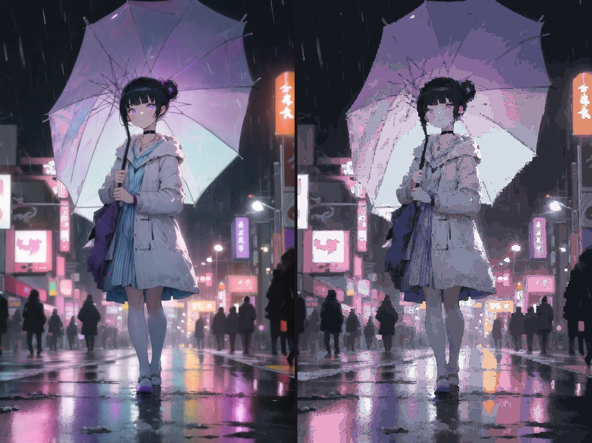

# deepseek-v4-flash-vision-mirror

Two skills that let a **text-only model run a real build → look → fix loop** by borrowing eyes
from an image-capable route.

- **`vision-loop`** — the protocol: pin an image-capable route, transport images at 1:1,
  evaluate with coverage and edge/flat discipline, and **validate your reference before
  optimising against it**.
- **`web-repro`** — the page-level procedure layered on top: capture a real reference, build a
  structural model before touching pixels, and verify globally / structurally / locally. It
  exists because region crops are structurally blind to the failures that broke a real
  reproduction.

The name is the point: the model doing the work has no vision. It doesn't need any — vision
capability belongs to the *route*, not to the model, and a subagent can be pinned to a
vision-capable route for a single call. What it must never do is substitute imagination for
a render.

## The four invariants

Every rule in both skills descends from these four. They are not vision-specific — they apply to
any verification loop — and each one subsumes many individual failures.

**1. Validate every input, including the ones you produced.**
At each stage you consume something you did not make and cannot see: a captured reference, a
render, a metric you wrote. Every serious failure here has been an unvalidated input, never a bad
edit. A loop that only asks *"does mine match my reference?"* converges confidently on that
reference's errors.

**2. Name what a check is blind to before you trust it.**
A check sees only what its frame admits. A metric cannot see a missing element. A crop cannot see
a framing error. A mean cannot see a distribution. State the blind spot and cover it with a
*different* check, not a bigger version of the same one.

**3. Name the acceptance criterion before you build the measurement.**
Then ask whether the measurement is a faithful proxy. A proxy you chose yourself drifts toward
what you can measure. "Matches the design" and "low MAE" are different claims.

**4. Iteration refines within a frame; it cannot detect a wrong frame.**
Schedule the frame-breaks explicitly. They will not happen on their own, because everything inside
the loop looks self-consistent.

Everything below is evidence: the specific measurements that each invariant was learned from.
The skills themselves stay short and carry only the principles, the procedure, and the tools.

## The problem this solves

A text-only agent asked to reproduce a design or check its own output has no ground truth.
It cannot see the reference, cannot see what it produced, and cannot tell whether a change
helped. The failure mode is not "it refuses" — it is **confident, plausible, unverifiable
output**. Every rule in this skill exists because that failure was observed and measured.

## Proven capability

One protocol, demonstrated on the two artifact classes that behave completely differently:

| Reference is | Reproduce by rendering? | Demonstration |
|---|---|---|
| UI, page, poster, chart, layout, icon | **Yes** — read the structure, write code, render, compare | [`examples/site-repro/`](examples/site-repro/) — a live site rebuilt in hand-written HTML/CSS to **MAE 1.37 / PSNR 29.92 dB**, with the hero, nav and footer judged a faithful match by vision |
| Photograph, painting, illustration | **No** — a tracer yields a lossy stylization, not a reproduction | [`examples/hero-trace/`](examples/hero-trace/) — traced to PSNR 24.65 dB, SVG **4.2× the source**, detail visibly gone |

Deciding which row you are in is step one, and the single most important rule in the skill.

**What it cannot do.** Match a font it does not have — the worst region of the site
reproduction (MAE 4.53) is font-file substitution, not layout, with every measured position
within 1–2px. Repaint a bitmap painting in code. Produce responsive, hover, focus or motion
states that a static reference does not contain. And it cannot **design**: with no reference
there is nothing to align to.

## Install

```bash
cp -r vision-loop web-repro ~/.agents/skills/     # user-level, all projects
# or
cp -r vision-loop web-repro <project>/.dsh/skills/  # project-level
```

DSH discovers skills from `~/.agents/skills`, `$DSH_HOME/skills`, and `<project>/.dsh/skills`.
`web-repro` requires `vision-loop`, which it cross-references.

## Why page-level verification is a separate skill

Region-by-region comparison — the core of `vision-loop` — is what makes detail work possible, and
it is **structurally incapable** of seeing a framing error: cropping both sides at identical
coordinates guarantees you can only see differences *inside* the crop.

A real attempt, measured both ways:

| Compared against | MAE |
|---|---|
| Its own reference capture | **1.37** — the number it reported as success |
| The real site, at a real viewport, first 900px | **30.59** |
| The real site, full page | **47.35** |

The navigation bar scored 3.68 (genuinely right). The hero copy scored **64.88** while vision
agents were calling it a faithful match. The loop was measuring its distance to its own mistake.

Four things it never noticed, all invisible to a region crop:

- the capture was taken at a viewport as tall as the page, so a `min-h-[92vh]` hero made the
  reference **1598px taller than the real page** at a normal window
- the capture was **truncated**: the page's own `scrollHeight` at that viewport was 5706px, the
  image was 4235px
- below-the-fold sections rendered as **blank bands** because scroll-reveal animations never
  fired — and a blank band looks exactly like a designed flat band, so a video player and an
  entire featured-episode section were reproduced as empty rectangles
- a real `<video>` element could not be distinguished from a flat block by pixels

`web-repro` exists for those four. Its rules are the procedure; `vision-loop`'s Rule 0 is the
principle behind them.

## Evidence — how each invariant was learned

**1. Eyes are borrowed, and the model must be pinned.**

A subagent that does not pin a model inherits the default route, which is text-only. Measured
on an unpinned subagent that had been told to inspect an image: its session log contained
`"model":"deepseek-v4-flash"` 22 times and the vision model id zero times. It had no eyes.

The plain `subagent` tool exposes only `description`/`prompt`/`run_in_background` — it has
**no model override and can never be given eyes**. Use the workflow tool:

```js
await agent("<inspect /abs/path.png>", {
  provider: "deepseek-official",
  model: "deepseek-v4-flash-vision-exp",
  schema: { /* ... */ },
});
```

An uncatalogued model id defaults to text-only, so a custom endpoint must be declared
image-capable first.

**2. Transport at 1:1 — two caps, both silent.**

| Cap | Default | If exceeded |
|---|---|---|
| `imagePixelBudget` | 640,000 px | image is **resized** |
| `imageMaxBytes` | 1 MiB | image is **re-encoded** |

Only an image under **both** is passed through byte-for-byte. A 2560×1440 screenshot reaches
the model as roughly 800×450. The byte cap is the one everyone misses: an 800×800 **PNG** crop
of a photograph measures ~997 KB — 27 KB under the cap, so a slightly noisier source trips it
silently. Use `tiles.mjs`, which checks both and falls back to JPEG.

**3. Ask for measurement, not opinion.**

Vision agents are good rulers and poor judges. Asking "does this look good?" returns
politeness; asking for hues, coordinates and pixel values returns defects. And verify their
claims — a passing remark about "red lines on the edges" is what exposed a real 7% coverage
bug that every numeric metric had missed.

**4. Never trust a single number.**

- **Transparent pixels scored as black.** `removeAlpha()` drops alpha and leaves RGB, so an
  uncovered pixel compares as if it were black. Always flatten onto white. Then keep the two
  alpha conditions apart, because they mean different things: `alpha==0` is genuinely
  unpainted, while `0<alpha<255` is normally correct edge antialiasing — and a hairline seam
  only where it falls on an internal region boundary. Conflating them produced a claim of
  "7.12% uncovered" when 0.13% was unpainted and 6.99% was antialiasing.
- **One number hides the binding constraint.** Error concentrates at edges — a single MAE
  concealed the fact that 7.4% of pixels carried 34% of the error. Split edge vs flat.
- **Absolute numbers are meaningless without a control.** Score an alternative so "is it
  good?" becomes "is it better?".

**5. Decide the artifact class before anything else.**

| Reference is | Renderer can reproduce? |
|---|---|
| UI, poster, chart, layout, text | Yes — extract tokens, write code, render, compare |
| Photograph, painting, illustration | **No** — use the file as-is, or generate a variant |

A continuous-tone target has no recoverable structure. Tracing one yields a lossy stylization,
not a reproduction: the SVG grew to **6–8× the size of the source JPEG** and still lost the
detail that matters. Say so before starting.

Then do not mistake a poor score for the method's ceiling. That trace scored 25.33 dB, while a
**realizable** flat-region rendering built from its own 13-colour palette reaches **29.25 dB**
and its per-pixel oracle **30.60 dB** — roughly 4 dB of headroom that was the tracer's
geometry, not a limit of the approach.

## What's here

```
vision-loop/        the protocol: borrowed eyes, 1:1 transport, evaluation discipline, artifact-class gate,
                    and validating your reference before optimising against it
  SKILL.md
  tiles.mjs         slice any image into transport-safe 1:1 tiles (checks both caps)
  render-eval.mjs   render a candidate and score it: coverage check, edge/flat split, control-ready
web-repro/          the page-level procedure: real reference, structural model, three-way verification
  SKILL.md
tools/              used by the site reproduction; not part of either skill
  shot-attach.mjs   screenshot HTML over CDP through a long-lived Chrome — no per-render escalation,
                    and --scroll fires reveal animations before capturing
  probe-dom.mjs     read a render's own layout back: boxes in fractional CSS px, computed styles, tokens
examples/
  trace.mjs         raster -> vector: OKLab k-means + boundary tracing + Bezier fitting
  site-repro/       the structural case — a live site rebuilt in hand-written HTML/CSS
  hero-trace/       the continuous-tone case — tracing what cannot be traced
```

## Worked examples

### The structural case: rebuilding a site

[`examples/site-repro/`](examples/site-repro/) rebuilds
[ayasemai.com/zh/](https://ayasemai.com/zh/) in HTML/CSS — original artwork by the repository
author — and scores **MAE 1.37 / PSNR 29.92 dB** over a 1440×4235 page.


*Left: the reference. Right: the reproduction.*

This example is where the division of labour becomes measurable. The TRAILER heading was
**completely missing** from the reproduction at one point (a CSS selector bug: `.hero .wrap` also
matched a nested `.wrap`, pushing the heading 1007px down into the media band). The region MAE
at that moment was **1.97**; after the heading rendered correctly it was **2.22**.

**The metric went up when the defect was fixed, and barely moved while an entire heading was
absent.** Vision agents caught it on the first look. That is the case for vision being the
acceptance standard and not the metric:

| Role | Good at | Not good at |
|---|---|---|
| Vision agent | noticing *that* something is wrong, and *what kind* (missing / mispositioned / wrong colour) | explaining *why*; exact coordinates |
| Programmatic measurement | quantifying *how much*, once you know what to measure | deciding what is wrong; naive statistics can be too coarse |
| Pixel MAE / PSNR | tracking direction across revisions | being an acceptance criterion |

Neither side is taken on trust. In the same run the agent **fabricated** a defect — reporting the
body text "printed twice" when measurement showed it was the hero artwork showing through, the
text simply being 8px too low — while my own fill-ratio statistic was **too coarse** to see that
the language-pill dot was a ring rather than a disc, which the agent's luminance profile got
right.

### The continuous-tone case: tracing what cannot be traced

[`examples/hero-trace/`](examples/hero-trace/) runs the loop end to end on an anime key visual —
a girl with a translucent umbrella on a neon rain-soaked street — and reports what it cost.
The source artwork is from the same author's animation IP at
**[ayasemai.com](https://ayasemai.com)**; see that example's README for the full credit.



*Left: the source. Right: the SVG, rasterized back.*

| | |
|---|---|
| Source | 1360×2048 WebP, 159 KB — **4.35× the transport budget**, so it had to be tiled to be read |
| Distinct colours / top-10 share | 132,758 / **6.5%** — continuous-tone, no flat fills |
| Result | 28 colours, 5,274 closed loops, **24.65 dB**, 0% unpainted |
| Cost | SVG **665 KB — 4.2× larger than the source**, and still visibly lossy |
| Ceiling from its own palette | realizable 27.66 dB, oracle 29.93 dB → the trace is **3.01 dB short** |

The example deliberately fails, because the reference is continuous-tone and a flat-colour
vector cannot reproduce it. What makes it worth reading is the *diagnosis*: on this image the
palette is the binding constraint (edges carry only 41.7% of the error), whereas on the
illustration traced while building the skill the opposite held (edges, 7.4% of pixels, carried
63.9%). Same tool, different failure — which is why the edge/flat split is always reported.

`examples/trace.mjs` is not part of the skill. It is the tool these rules were derived from,
including the two bugs the loop caught in it (transparent gaps from `fill-rule="evenodd"`, and
an MAE that reported a sum instead of a mean).

## Trace measurements

The vectorisation figures quoted above, measured on a 964×1340 source:

| Version | MAE | PSNR | `alpha==0` | SVG |
|---|---|---|---|---|
| 14 colours, `evenodd`, no background | 7.287 | 25.33 | 0.126% | 345 KB |
| 14 colours, `nonzero` + background rect | 7.221 | **26.37** | 0.000% | 1001 KB |
| 48 colours, `nonzero` + background rect | **6.127** | 24.69 | 0.000% | 1383 KB |

Ceilings for the first row's **own 13-colour palette**, measured independently of the trace:

| Control | PSNR |
|---|---|
| The trace as delivered | 25.33 dB |
| **Realizable** — per-pixel nearest, then a 3×3 majority filter (contiguous flat regions) | **29.25 dB** |
| **Oracle** — per-pixel nearest (not reachable by flat regions) | **30.60 dB** |

The trace therefore sits **3.92 dB below what its own palette can realize**. Colour count was
never the binding constraint; boundary geometry was — of disagreeing pixels, 99.4% lie within
2 px of a true boundary.

Three further measurements that changed this skill's design:

- **More colours lowers MAE while lowering PSNR** — they trade flat-region accuracy for edge
  error, so neither number alone describes the result.
- **Disabling despeckling cost 4.5 dB.** The intuition that it was injecting error was wrong,
  and only a controlled test showed it.
- **Coloured scaffolding in a comparison image becomes a finding.** A red divider made vision
  agents report "red hairlines along the edges"; a `#1e1e22` separator gutter made two of them
  report a phantom 14th fill colour. Both artifacts belonged to the experimenter.

### On borrowed eyes

The fidelity numbers above were independently reproduced by a separate agent working only from
this skill (MAE 7.287, PSNR 25.33, alpha gap 7.1203%), and that agent then corrected the skill:
the 7.12% it was warned about was 6.99% antialiasing plus 0.13% unpainted.

Twelve pinned vision agents unanimously and correctly distinguished continuous-tone reference
from quantized render, and correctly identified the lost features. Their **coordinates and
severity estimates were unreliable** — one reported "dark streak" measured 6 px, another
reported "speck at row 255" did not exist. Use them for character, not for locating.

## Requirements

- `sharp` for SVG rasterization and image analysis. It ships inside the DSH app bundle:
  ```js
  const { createRequire } = require("node:module");
  const require2 = createRequire("/Applications/DSH Desktop.app/Contents/Resources/app/package.json");
  const sharp = require2("sharp");
  ```
- SVG → PNG via `sharp` (librsvg) runs in-sandbox with no browser and no escalation. Prefer it.
  HTML → PNG needs Chrome, where `chrome --screenshot` **hangs** on macOS and must be driven
  over CDP instead — and Chrome writes outside the workspace, so it needs a wider sandbox on
  every run. That breaks unattended loops.
