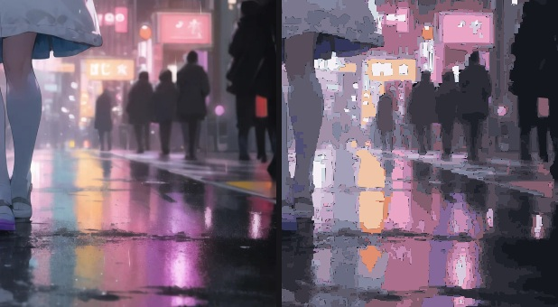
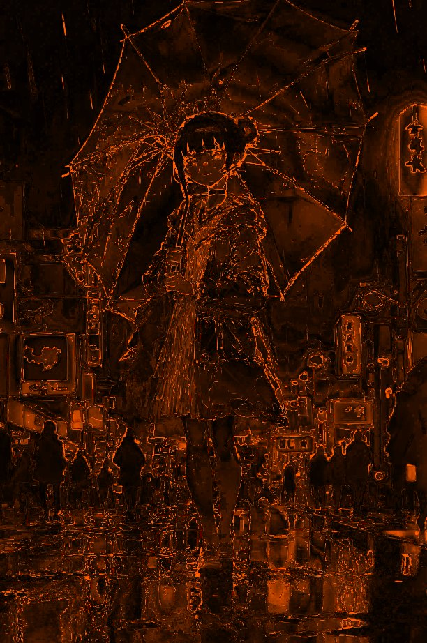

# Example: tracing an illustration to SVG

A worked run of the `vision-loop` on a continuous-tone anime key visual — a girl with a
translucent umbrella on a neon rain-soaked street — to show both what the loop measures and
where the artifact-class boundary actually falls.

**Read this as a demonstration of the boundary, not of a reproduction.** The result is a
deliberate stylization. Every number below was computed, and the ceilings it is measured
against were built from the trace's own palette.

## The source

| | |
|---|---|
| File | `reference.webp` — 1360×2048, 159 KB |
| Image credit | original work by the repo author — **[ayasemai.com](https://ayasemai.com)** |
| Pixels | 2,785,280 — **4.35× the 640,000 px transport budget** |
| Distinct colours | 132,758 (4.8% of pixels) |
| Top-10 colour share | **6.5%** |
| Flat neighbours (Δ≤3) | 62.1% |

> **Artwork credit:** the illustration in this directory (`reference.webp`) is original work by
> the repository author, from their animation IP project at
> **[ayasemai.com](https://ayasemai.com)**. It is used here as a test input for the tracing
> pipeline. The artwork is not covered by any license granted for this repository's code.

A UI or poster has few flat fills and a dominant palette: the control measured while building
this skill was 916 colours with its top 10 covering 86.6%. At 132,758 colours with the top 10
covering 6.5%, there are essentially **no flat fills** — this is continuous-tone, so no
renderer can reproduce it. Confirmed independently by the vision route: three pinned agents
reading an overview and two 1:1 tiles all reported smooth gradients, painterly edges, and no
flat quantisation. No legible text exists in it (the neon signage is deliberately blurred
pseudo-text).

Because the source is 4.35× over budget, reading it at 1:1 required tiling:

```bash
node ../../vision-loop/tiles.mjs reference.webp _tiles
# -> 6 tiles, 800x800 max, all under BOTH the pixel and byte caps
```

## The result

Traced at 0.45× (612×922 = 564,264 px) — a scale chosen so that **the trace's own output is
itself transport-safe** and can be handed straight back to a vision agent without further tiling.


*Left: source. Right: the SVG rasterized back to PNG.*

At README scale the two look close. At 1:1 they do not, and that is the honest view:



*1:1 crop of the neon shopfronts and figure, no downscaling. The trace resolves the large
shapes and the colour scheme, and loses the glow gradients, the fine rain streaks, the
out-of-focus bokeh of the street lamps, and the soft edges between the figure and the haze.*

The 28 colours it was reduced to:


And where the error lands:



*Error amplified 4×. The loss is spread across the smooth neon falloff, not concentrated on
silhouettes — see the edge/flat split below.*

## Measurements

Produced by `render-eval.mjs` (reference = `source-612x922.webp`, candidate = `trace.svg`):

| Metric | Value |
|---|---|
| MAE (per channel) | **8.56** |
| RMSE | **14.94** |
| PSNR | **24.65 dB** |
| Max channel error | 221 |
| Fully unpainted (`alpha==0`) | **0.000%** |
| Partially covered | 0.000% |
| SVG size | 665 KB |
| Paths | 28 |
| Closed loops | 5,274 |
| Path commands | 77,335 |

### Where the error is

| | share of pixels | MAE |
|---|---|---|
| Edges (source gradient > 60) | 9.3% | 21.20 |
| Flat regions | 90.7% | 7.26 |

Edges carry **41.7%** of the squared error. Compare that to the illustration traced while
building this skill, where edges were 7.4% of pixels and carried **63.9%** — the opposite
failure. Here the palette is the binding constraint, because neon glow is a continuous
gradient covering the whole frame and 28 flat colours cannot follow it. **The same tool fails
for different reasons on different images**, which is exactly why the split is reported.

### The ceiling, from its own palette

Controls built from the 28 colours the trace itself chose:

| Control | PSNR |
|---|---|
| The trace as delivered | 24.65 dB |
| **Realizable** — per-pixel nearest, then a 3×3 majority filter (contiguous flat regions) | **27.66 dB** |
| **Oracle** — per-pixel nearest (not reachable by flat regions) | **29.93 dB** |

The trace sits **3.01 dB below what its own palette can already realize**. The same gap
appeared on the other image (3.92 dB), which suggests it is a property of this tracer's
boundary geometry rather than of either picture.

## Cost

| | |
|---|---|
| Source WebP | 159 KB |
| SVG | **665 KB** — 4.2× larger |
| Total example assets | ~2.0 MB |

Vectorizing made the file **larger** and still lost detail. That is the expected outcome for
continuous-tone input, and the reason the skill says to decide the artifact class before
starting.

## Reproduce

Everything below runs from this directory. `source-612x922.webp` is committed, so the
measurement reproduces as-is; the first step is only needed to regenerate it.

```bash
# 0. (optional) regenerate the trace input — lossless, so the numbers above are unaffected
node -e '
  const {createRequire}=require("node:module");
  const sharp=createRequire("/Applications/DSH Desktop.app/Contents/Resources/app/package.json")("sharp");
  sharp("reference.webp").resize(612,922,{fit:"fill"}).webp({lossless:true,effort:6})
    .toFile("source-612x922.webp");
'

# 1. tile the 4.35x-oversized source so a vision agent can read it at 1:1
node ../../vision-loop/tiles.mjs reference.webp _tiles

# 2. trace (28 colours, OKLab k-means, Bezier-fitted contours)
node ../trace.mjs source-612x922.webp trace.svg \
     --colors=28 --tol=0.8 --min-area=6 --space=oklab --curve=bezier

# 3. render, score, check coverage, and emit a side-by-side
node ../../vision-loop/render-eval.mjs source-612x922.webp trace.svg "hero trace" --side=compare.png
```

## Verdict

**A stylization, not a reproduction.** 24.65 dB with 41.7% of the squared error on 9.3% of
pixels means the glow gradients and fine detail are visibly gone, and the SVG is four times
the size of the source. Improving the tracer can recover at most ~3 dB against its own
palette; reaching genuine fidelity would mean abandoning flat-colour vectorization entirely.
