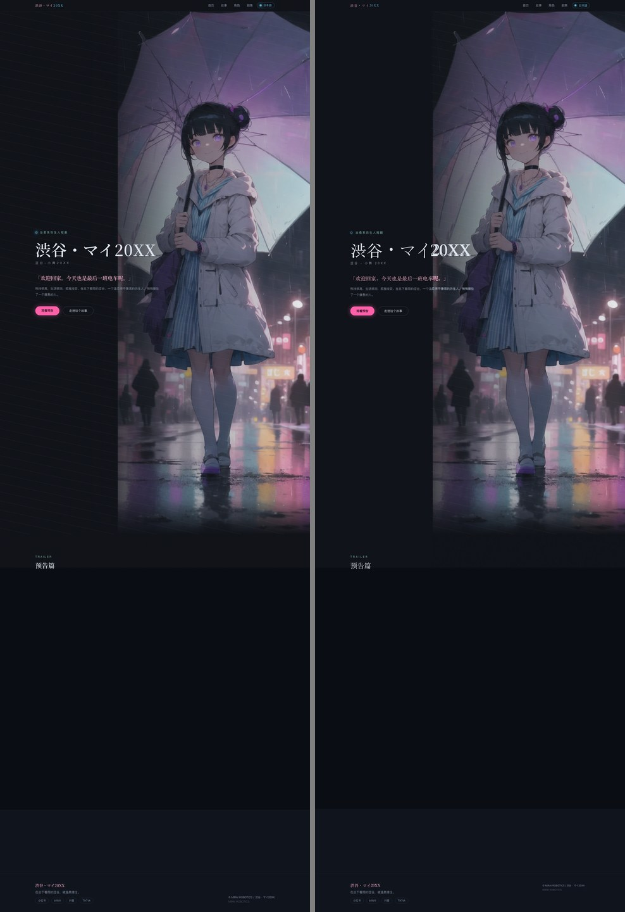

# Example: reproducing a live website in HTML/CSS

A worked run of the loop on the **structural** artifact class — the case the loop is actually
for. The reference is [ayasemai.com/zh/](https://ayasemai.com/zh/) (original artwork by the
repository author); the output is hand-written HTML/CSS, not a trace.

Contrast with [`../hero-trace/`](../hero-trace/), which deliberately does the *wrong* thing to a
continuous-tone image and measures what it costs. This example does the right thing.

## Result

Rendered at 1440×4235 against a 1440×4235 reference capture:

| Metric | Value |
|---|---|
| Full page MAE | **1.37** / 255 |
| Full page PSNR | **29.92 dB** |

Region by region:

| Region | MAE | Note |
|---|---|---|
| Navigation bar | 2.30 | |
| Hero copy column | 4.53 | dominated by font-file substitution, not layout |
| TRAILER heading | 2.22 | |
| Media band | **0.00** | a flat colour block, reproduced exactly |
| Footer | 1.02 | |

Final vision verdicts, from pinned image-capable agents comparing 1:1 crops:
**hero = faithful match**; nav, trailer and footer = close with minor differences only.



*Left: the reference. Right: the reproduction.*

## Why the number alone would have been enough to fail this

The TRAILER heading was completely missing from the reproduction at one point — a CSS selector
bug where `.hero .wrap` also matched a nested `.wrap` inside the heading block, adding 1007px of
padding and pushing the heading down into the media band.

Region MAE at that moment: **1.97**. After the heading rendered in the correct place: **2.22**.

**The metric went up when the defect was fixed, and barely moved while an entire heading was
absent.** A verification standard that cannot see a missing heading is not a verification
standard. The vision agents caught it immediately; the metric never would have.

## What the loop caught, and what it got wrong

Four real defects the pixel metrics could not have found:

1. The entire TRAILER heading not rendering (the selector bug above)
2. The footer wordmark inheriting `letter-spacing: 2.8px` from the nav rule, spreading the logo
   out instead of rendering it as one solid block
3. The footer wordmark wrongly rendered with the nav's pink→cyan two-tone stop
4. The four nav links sitting 33px too far left, because a flex `gap` also applied between the
   last link and the pill

And one it **fabricated**: it reported the body paragraph's first line "printed twice". Direct
measurement showed the ink came from the hero *artwork* showing through — the text was simply 8px
too low, so rows that should have been covered by text exposed the image beneath. The observation
("something is wrong in this region") was correct; the mechanism was invented.

Conversely, my own measurement was wrong once. I dismissed its claim that the language-pill dot
was a ring rather than a disc, using a fill-ratio threshold (27% vs 27%). A luminance *profile*
settled it: the reference is bright rim (~180) with a dimmer core (~133), and both exceed a
naive threshold. **The agent's profile measurement was finer-grained than my statistic.**

## How the two roles divide

| Role | Good at | Not good at |
|---|---|---|
| Vision agent | noticing *that* something is wrong, and *what kind* (missing / wrong position / wrong colour) | explaining *why*; localizing to exact coordinates |
| Programmatic measurement | quantifying *how much*, once you know what to measure | deciding what is wrong; naive statistics can be too coarse |
| Pixel MAE / PSNR | tracking direction of travel across revisions | anything used as an acceptance criterion |

The division of labour that worked: **the agent finds it, I verify it, and no explanation from
either side is taken on trust.**

## Method

1. Capture the reference by rendering the live site at the target viewport with `tools/shot-attach.mjs`.
2. Read the reference at two scales — a downscaled whole page for structure (layout, bands,
   palette) and 1:1 tiles for detail (exact copy, sizes, colours). Both via pinned
   `deepseek-v4-flash-vision-exp` agents, because the working model has no vision.
3. Write the HTML/CSS from the measurements.
4. Render it, then compare **region by region** at 1:1, side by side with a *neutral* grey
   separator and an explicit instruction that the separator is scaffolding.
5. Measure the residual per region, fix, repeat.

Step 4 is where the value is. A whole-page comparison gets downscaled to mush; a 1:1 region pair
survives transport intact, and because both halves share crop coordinates a difference the agent
spots is locatable without trusting its coordinates.

## Reproduce

```bash
# once: a long-lived render server (the only step needing wider sandbox permissions)
"/Applications/Google Chrome.app/Contents/MacOS/Google Chrome" --headless --no-sandbox \
  --disable-gpu --disable-breakpad --disable-crash-reporter --hide-scrollbars \
  --force-color-profile=srgb --remote-debugging-port=9222 \
  --user-data-dir=/tmp/dsh-chrome about:blank &

# capture the reference, then render the reproduction
node ../../tools/shot-attach.mjs "https://ayasemai.com/zh/" reference-full.png 1440 4235 1 --wait=3000 --full
node ../../tools/shot-attach.mjs index.html mine-full.png 1440 4235 1 --full

# read back the reproduction's own layout, in fractional CSS px
node ../../tools/probe-dom.mjs index.html --sel=".eyebrow,h1,.lede,.btn"
```

## What is not reproduced

- **The hero artwork** (`assets/hero.webp`). It is a bitmap painting; no renderer repaints it.
  It is placed as the site's own asset, and **the artwork region is excluded from the fidelity
  claim above** — comparing it would be comparing a file against itself.
- **Fonts.** The residual in the hero copy column (MAE 4.53, the worst region) is font-file
  substitution, not layout error. Every measured position is within 1–2px; the glyphs differ.
- **The trailer video.** It did not render in the reference capture either — that band is a flat
  `#0a0d13`, which is what got reproduced.
- **Responsive breakpoints, hover/focus states, animation.** Absent from a static reference.
- **The design.** This loop reproduces a reference; it does not design. With no reference it has
  nothing to align to.
